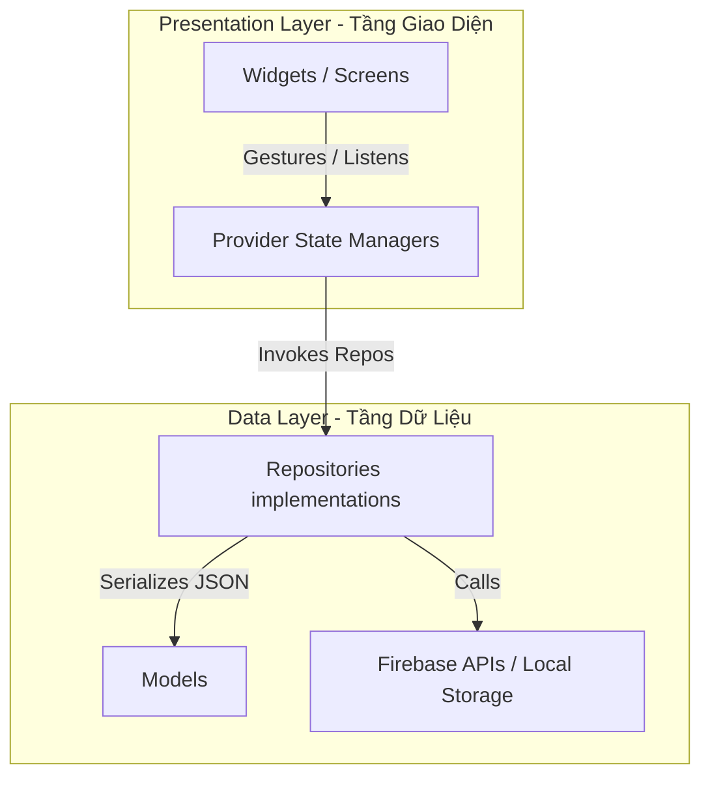

# 🚀 PingPic - Ứng dụng Chia sẻ Khoảnh khắc Thời gian thực

[](https://flutter.dev)
[](https://firebase.google.com)
[](https://dart.dev)
[](#)
[](#)

PingPic là một ứng dụng chia sẻ ảnh và khoảnh khắc thời gian thực (lấy cảm hứng từ concept của Locket) có thiết kế responsive đẹp mắt và tối ưu hóa mạnh mẽ cho nền tảng Web. Ứng dụng được xây dựng trên nền tảng **Flutter (Material 3)** và hệ sinh thái serverless của **Firebase**.

---

## ⚡ Các Điểm Nhấn Công Nghệ Nổi Bật

### 🏎 1. Cuộn Feed Snap Mượt Mà 120 FPS
Trên trình duyệt máy tính, con lăn chuột phát ra các tín hiệu cuộn rời rạc (`PointerScrollEvent`) thay vì dòng sự kiện vuốt liên tục như trên màn hình cảm ứng của điện thoại. Việc này thường gây ra hiện tượng khựng giật (jank) khi cuộn `PageView` trên Web. PingPic đã khắc phục triệt để bằng cách khóa hành vi cuộn mặc định (`NeverScrollableScrollPhysics`) trên Web/Desktop và lắng nghe tín hiệu cuộn chuột rời rạc để tự động kích hoạt animation chuyển trang thông qua các hàm nội suy Cubic, đạt hiệu năng mượt mà **120 FPS** trên mọi trình duyệt hiện đại (Chrome, Edge, Opera, v.v.).

### 🪂 2. Kéo Thả File Ảnh Trực Tiếp Trên Web (Drag & Drop)
Khi kéo thả một file ảnh từ máy tính vào trình duyệt, hành vi mặc định của trình duyệt là mở file đó ở một tab hoặc URL mới, làm gián đoạn ứng dụng web. PingPic sử dụng các event listener ở capturing-phase (`dragover` và `drop` với `useCapture = true`) gắn trực tiếp vào window của trình duyệt. Giải pháp này giúp chặn hoàn toàn hành vi điều hướng mặc định của trình duyệt, trích xuất dữ liệu ảnh (PNG, JPG, JPEG, WEBP) thành chuỗi byte thô (`Uint8List`) và đưa trực tiếp vào luồng xử lý của ứng dụng để hiển thị ảnh preview tức thì.

### 🔒 3. Ghi Nhớ Đăng Nhập & Bảo Mật Session
Tích hợp tính năng "Ghi nhớ đăng nhập" thông qua `SharedPreferences`. Khi được kích hoạt, trình duyệt sẽ lưu trạng thái session cục bộ (`Persistence.LOCAL` của Firebase Auth) giúp người dùng giữ trạng thái đăng nhập ngay cả khi tải lại trang hoặc đóng trình duyệt. Ngược lại, nếu tùy chọn này bị tắt, ứng dụng khi khởi động sẽ tự động gọi lệnh `signOut()` để xoá sạch cache auth, ngăn chặn việc rò rỉ dữ liệu hoặc nháy trang chủ.

---

## 🎨 Tổng Quan Các Tính Năng

- **Xác Thực Người Dùng**: Trang Đăng nhập/Đăng ký trực quan với tính năng kiểm tra định dạng email và độ mạnh mật khẩu client-side.
- **Giao Diện Responsive 3 Layout**:
  - *Desktop (≥ 1200px)*: Sidebar điều hướng bên trái, Feed ảnh ở giữa và Camera Panel cố định bên phải.
  - *Tablet (900px – 1199px)*: Thanh điều hướng phía trên, Feed ảnh (60%) và Camera Panel (40%) xếp ngang.
  - *Mobile (< 900px)*: Feed ảnh full-width, thanh điều hướng phía dưới và nút Camera nổi (FAB) để mở Camera dưới dạng Bottom Sheet.
- **Moment Editor Tiện Ích**: Hỗ trợ vẽ tay tự do, chèn text overlay, chọn emoji sinh động hoặc tìm kiếm chèn ảnh GIF động từ GIPHY. Toàn bộ các layer vẽ và nhãn dán sẽ được Canvas Composer gom và nén phẳng thành một file ảnh JPG duy nhất trước khi lưu trữ.
- **Mạng Lưới Bạn Bè & Trạng Thái Trực Tuyến**: Gửi/nhận lời mời kết bạn và hiển thị danh sách bạn bè kèm chấm xanh báo hiệu trạng thái online thời gian thực.
- **Lịch Sử Khoảnh Khắc (My Moments)**: Cho phép xem lại toàn bộ ảnh đã đăng dưới dạng Lưới (Grid) hoặc Danh sách (List), tích hợp hiệu ứng hover zoom mượt mà và tính năng xoá ảnh đồng bộ dữ liệu Firestore & Firebase Storage.

---

## 🛠 Công Nghệ Sử Dụng

| Danh Mục | Công Nghệ | Vai Trò & Mục Đích |
| :--- | :--- | :--- |
| **Lập Trình Core** | **Dart 3.x / Flutter SDK ^3.5.0** | Biên dịch ứng dụng đa nền tảng chất lượng cao. |
| **Quản Lý Trạng Thái** | **Provider ^6.1.2** | Đồng bộ hóa dữ liệu Auth, Feed, Editor, Friends, Themes. |
| **Điều Hướng Trang** | **GoRouter ^14.3.0** | Hỗ trợ Deep-linking, đồng bộ URL Web và Route Guards. |
| **Hệ Thống Backend** | **Firebase (Auth, Storage, Firestore, Cloud Messaging)** | Đăng nhập an toàn, lưu trữ ảnh thô và cơ sở dữ liệu thời gian thực. |
| **Xử Lý Hình Ảnh** | **ImagePicker & CachedNetworkImage** | Chọn ảnh từ thiết bị/Webcam và tối ưu bộ nhớ đệm hình ảnh. |
| **Trải Nghiệm UI/UX** | **Shimmer & Lottie** | Hiển thị skeleton loading mượt mà và các hiệu ứng tim bay. |

---

## 📐 Kiến Trúc Hệ Thống

PingPic tuân thủ chặt chẽ mô hình **Clean Architecture kết hợp Feature-based** để đảm bảo khả năng mở rộng lâu dài và tách biệt hoàn toàn giữa logic nghiệp vụ với thư viện UI:



- **`lib/core/`**: Cấu hình router (`app_router.dart`), themes hệ thống (`app_theme.dart`), và các helper hỗ trợ conditional compilation đa nền tảng (ví dụ: `webcam_helper_web.dart` tránh lỗi crash trên mobile).
- **`lib/data/`**: Chứa các Model dữ liệu và Repository kết nối cơ sở dữ liệu.
- **`lib/presentation/`**: Chứa giao diện người dùng, widget tái sử dụng và quản lý state.

---

## 🗃 Cấu Trúc Cơ Sở Dữ Liệu Firestore

Cơ sở dữ liệu NoSQL được thiết kế tối giản để hỗ trợ đồng bộ hóa thời gian thực:

```text
users/ (Thông tin người dùng)
 ├── uid: String (Document ID)
 ├── email: String
 ├── fullName: String
 ├── avatarUrl: String
 ├── isOnline: Boolean
 └── lastSeen: Timestamp

friendships/ (Mối quan hệ bạn bè)
 ├── requesterId: String
 ├── receiverId: String
 └── status: String ("pending" | "accepted")

moments/ (Các bức ảnh khoảnh khắc)
 ├── userId: String
 ├── imageUrl: String
 ├── caption: String (Có thể rỗng)
 ├── createdAt: Timestamp
 ├── likes: Array [UID của người dùng đã thả tim]
 └── comments/ (Sub-collection bình luận riêng tư)
      ├── senderId: String
      ├── receiverId: String
      ├── participants: Array [senderId, receiverId]
      ├── text: String
      └── createdAt: Timestamp
```

---

## 🚀 Hướng Dẫn Cài Đặt & Chạy Dự Án

### Yêu Cầu Hệ Thống
- **Flutter SDK**: `^3.5.0`
- **Java**: Development Kit `17`
- **Firebase CLI**: Đã đăng nhập và cài đặt trên máy.

### 1. Chạy Ứng Dụng Ở local
```bash
# 1. Clone repository về máy
git clone https://github.com/your-username/pingpic.git
cd pingpic

# 2. Tải các package phụ thuộc
flutter pub get

# 3. Chạy dự án trên Chrome (sử dụng CanvasKit để tối ưu hóa render đồ họa)
flutter run -d chrome --web-renderer canvaskit
```

### 2. Biên Dịch Android Release APK
Ứng dụng sử dụng một script reflection Kotlin DSL đặc biệt trong `android/app/build.gradle.kts` để hỗ trợ tự động đổi tên file APK đầu ra tương thích với AGP 8.x mà không bị crash compiler:
```bash
# Thực hiện build phiên bản release APK
flutter build apk --release
# File APK biên dịch thành công sẽ nằm tại: build/app/outputs/flutter-apk/PingPic-v1.0.0.apk
```

### 3. Triển Khai Lên Web (Firebase Hosting)
```bash
# 1. Build phiên bản web release
flutter build web --release --web-renderer canvaskit

# 2. Deploy lên Firebase Hosting công cộng
firebase deploy --only hosting
```

---

## 📂 Trung Tâm Tài Liệu Dự Án

Mọi tài liệu phân tích kỹ thuật chuyên sâu và kiến trúc chi tiết đã được sắp xếp khoa học trong thư mục `/docs` phục vụ mục đích lưu trữ và bàn giao dự án:

- 🗂 **Kiến Trúc**:
  - [`docs/architecture/FLUTTER_ARCHITECTURE.md`](file:///e:/University/HK2_25-26/PTUDDDDNT/doan/pingpic/docs/architecture/FLUTTER_ARCHITECTURE.md): Chi tiết sơ đồ layer, luồng đi của luồng GoRouter và Provider.
- 📋 **Báo Cáo Tóm Tắt**:
  - [`docs/summaries/FEATURES_SUMMARY.md`](file:///e:/University/HK2_25-26/PTUDDDDNT/doan/pingpic/docs/summaries/FEATURES_SUMMARY.md): Tổng quan các màn hình, responsive layouts và cơ chế render Canvas.
  - [`docs/summaries/TECH_STACK.md`](file:///e:/University/HK2_25-26/PTUDDDDNT/doan/pingpic/docs/summaries/TECH_STACK.md): Bảng phân tích chi tiết phiên bản các thư viện và tác vụ tối ưu.
  - [`docs/summaries/FIREBASE_ARCHITECTURE.md`](file:///e:/University/HK2_25-26/PTUDDDDNT/doan/pingpic/docs/summaries/FIREBASE_ARCHITECTURE.md): Thiết kế cấu trúc NoSQL, Storage, Security Rules và Realtime sync pipelines.
  - [`docs/summaries/SYSTEM_ANALYSIS.md`](file:///e:/University/HK2_25-26/PTUDDDDNT/doan/pingpic/docs/summaries/SYSTEM_ANALYSIS.md): Phân tích giải pháp cuộn chuột mượt mà, kéo thả file trực tiếp và script build APK Android.
  - [`docs/summaries/PROJECT_PROGRESS.md`](file:///e:/University/HK2_25-26/PTUDDDDNT/doan/pingpic/docs/summaries/PROJECT_PROGRESS.md): Lịch sử phát triển các Phase dự án và lộ trình tiếp theo.
- 📄 **Context Hỗ Trợ Agent & Báo Cáo**:
  - [`docs/report/FINAL_REPORT_CONTEXT.md`](file:///e:/University/HK2_25-26/PTUDDDDNT/doan/pingpic/docs/report/FINAL_REPORT_CONTEXT.md): Tổng hợp cô đọng toàn bộ thông tin dự án để làm ngữ cảnh viết báo cáo cuối kỳ.

---
