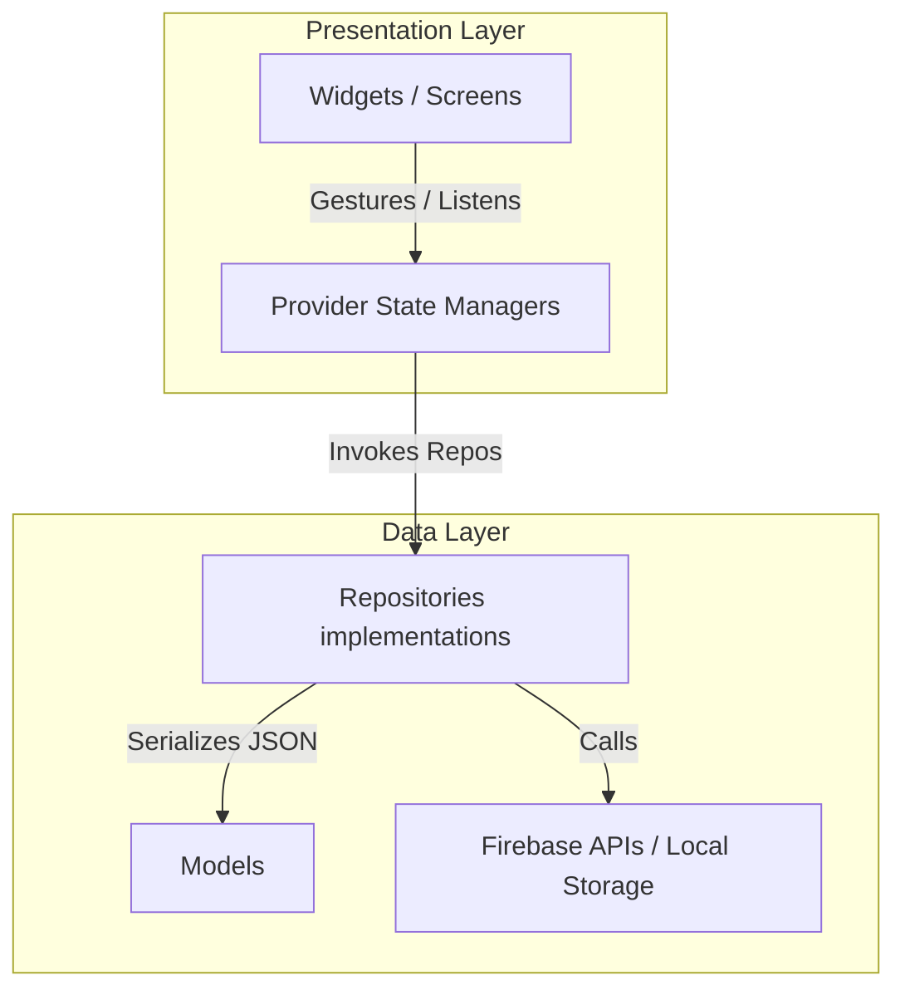

# 🚀 PingPic - Real-time Status Sharing Web App

[](https://flutter.dev)
[](https://firebase.google.com)
[](https://dart.dev)
[](#)
[](#)

PingPic is a real-time, responsive, interactive status-sharing social application (inspired by Locket) built on a serverless architecture using **Flutter (Material 3)** and **Firebase**. 

---

## 🌟 Core Highlights

### ⚡ 1. 120 FPS Buttery-Smooth Snap Scrolling
Discrete scroll wheel events (`PointerScrollEvent`) on desktop web browsers usually trigger frame stuttering and awkward jumps inside traditional `PageView` layouts. PingPic overrides default scroll physics using `NeverScrollableScrollPhysics` on Web/Desktop and employs a custom discrete pointer event listener to programmatically animate page snaps using cubic easings, achieving a buttery-smooth **120 FPS snapping feed**.

### 🪂 2. Capturing-Phase Web Drag-and-Drop Image Uploader
Dragging and dropping a local image file directly into standard web applications usually triggers browser tab takeovers, navigating away to open the dropped image path. PingPic attaches native capturing-phase drag handlers (`dragover` and `drop` with `useCapture = true`) to the global document window. This bypasses browser redirections, converting dropped images (PNG, JPG, JPEG, WEBP) directly to raw memory byte arrays (`Uint8List`) for instant uploads.

### 🔒 3. Persistent Sessions & Auto-SignOut Gates
Integrates a persistent login mechanism (`remember_me`) inside a custom `SharedPreferences` preference manager. If active, web browsers leverage Firebase Auth `Persistence.LOCAL` to survive refreshes and tab closures. If remember preference is disabled or deleted, the app startup sequence triggers an instant sign-out command, preventing authentication caches from leaking or displaying screen flashes.

---

## 🎨 Feature Overview

- **Auth Portal**: Validated login/registration screens with password strength and email checking.
- **Three-Tier Responsive Layout**:
  - *Desktop (≥ 1200px)*: Left navigation rail sidebar, central feed column, and right-side camera drawer.
  - *Tablet (900px – 1199px)*: Top navigation bar, central feed, and side camera drawer.
  - *Mobile (< 900px)*: Single-column full-width feed, bottom navigation bar, and floating action button (FAB) camera modal.
- **Interactive Moment Editor**: Crop, draw pen strokes, type text overlays, search and add dynamic GIPHY moving GIFs, or place category-based emojis onto captured images before rendering them onto a single JPG output byte stream.
- **Social Presence strip**: Connect with users, review incoming/outgoing requests, and monitor live online status indicators (green active dots).
- **Moments Archive**: Display previous posts inside responsive grids or list views. Features hover image scaling animations and quick deletes that remove indices from Firestore and images from Storage concurrently.

---

## 🛠 Technology Stack

| Category | Technology | Purpose |
| :--- | :--- | :--- |
| **Core Runtime** | **Dart 3.x / Flutter SDK ^3.5.0** | Unified multi-platform codebase rendering. |
| **State Container** | **Provider ^6.1.2** | Clean state trackings (Auth, Feed, Editor, Friends, Themes). |
| **Routing Manager** | **GoRouter ^14.3.0** | Deep-linking, native address sync, and route guards. |
| **Backend Suite** | **Firebase (Auth, Storage, Firestore, Cloud Messaging)** | Real-time database sync, user sessions, and binary storage. |
| **Media Handling** | **ImagePicker & CachedNetworkImage** | Media selection and device-level image caching. |
| **UX Additions** | **Shimmer & Lottie** | Loading skeleton card templates and dynamic heart animations. |

---

## 📐 System Architecture

PingPic follows standard **Clean Architecture & Feature-based Separation** guidelines to isolate business logic from database libraries and UI changes:



- **`lib/core/`**: Central router configs (`app_router.dart`), themes (`app_theme.dart`), stubs, and conditional compiler platform-independent helpers (e.g. `webcam_helper_web.dart`, `image_compressor_mobile.dart`).
- **`lib/data/`**: Network schemas (Models) and data collectors (Repositories).
- **`lib/presentation/`**: Screens, providers, and modular reusable visual components.

---

## 🗃 Firebase Database Schema

Firestore manages relational connections and snapshots through a simple, low-latency collection layout:

```text
users/ (User Profiles)
 ├── uid: String (Document ID)
 ├── email: String
 ├── fullName: String
 ├── avatarUrl: String
 ├── isOnline: Boolean
 └── lastSeen: Timestamp

friendships/ (Friend Connections)
 ├── requesterId: String
 ├── receiverId: String
 └── status: String ("pending" | "accepted")

moments/ (Post Entries)
 ├── userId: String
 ├── imageUrl: String
 ├── caption: String (Nullable)
 ├── createdAt: Timestamp
 ├── likes: Array [UIDs of users who liked]
 └── comments/ (Sub-collection)
      ├── senderId: String
      ├── receiverId: String
      ├── participants: Array [senderId, receiverId]
      ├── text: String
      └── createdAt: Timestamp
```

---

## 🚀 Setup & Installation Guide

### Prerequisites
- **Flutter SDK**: `^3.5.0`
- **Java**: Development Kit `17`
- **Firebase CLI**: Activated and logged in.

### 1. Local Running
```bash
# 1. Clone the repository
git clone https://github.com/your-username/pingpic.git
cd pingpic

# 2. Fetch flutter packages
flutter pub get

# 3. Start local development server (Web CanvasKit)
flutter run -d chrome --web-renderer canvaskit
```

### 2. Build Android Release APK
We implemented a resilient Kotlin DSL reflection script in `android/app/build.gradle.kts` to allow AGP 8.x dynamic output naming without compiler crashes:
```bash
# Compile and build the release APK
flutter build apk --release
# The compiled APK is output to build/app/outputs/flutter-apk/PingPic-v1.0.0.apk
```

### 3. Web Deployment (Firebase Hosting)
```bash
# 1. Compile Flutter production build
flutter build web --release --web-renderer canvaskit

# 2. Deploy to Firebase Hosting
firebase deploy --only hosting
```

---

## 📂 Documentation Hub

All technical specifications, architectural designs, and implementation reviews are structured professionally inside the centralized `/docs` directory:

- 🗂 **Architecture**:
  - [`docs/architecture/FLUTTER_ARCHITECTURE.md`](file:///e:/University/HK2_25-26/PTUDDDDNT/doan/pingpic/docs/architecture/FLUTTER_ARCHITECTURE.md): Class mappings, clean layer separators, routing flows, and VM bindings.
- 📋 **Summaries**:
  - [`docs/summaries/FEATURES_SUMMARY.md`](file:///e:/University/HK2_25-26/PTUDDDDNT/doan/pingpic/docs/summaries/FEATURES_SUMMARY.md): Screen structures, mobile/desktop drawers, and canvas composting.
  - [`docs/summaries/TECH_STACK.md`](file:///e:/University/HK2_25-26/PTUDDDDNT/doan/pingpic/docs/summaries/TECH_STACK.md): Package configurations, version mappings, and utility directories.
  - [`docs/summaries/FIREBASE_ARCHITECTURE.md`](file:///e:/University/HK2_25-26/PTUDDDDNT/doan/pingpic/docs/summaries/FIREBASE_ARCHITECTURE.md): Database collections, rules, storage schemas, and snapshot streams.
  - [`docs/summaries/SYSTEM_ANALYSIS.md`](file:///e:/University/HK2_25-26/PTUDDDDNT/doan/pingpic/docs/summaries/SYSTEM_ANALYSIS.md): Pointer scroll overrides, web drag capturing, and AGP build fixes.
  - [`docs/summaries/PROJECT_PROGRESS.md`](file:///e:/University/HK2_25-26/PTUDDDDNT/doan/pingpic/docs/summaries/PROJECT_PROGRESS.md): Active development phases and forward-looking roadmap.
- 📄 **Report & AI context**:
  - [`docs/report/FINAL_REPORT_CONTEXT.md`](file:///e:/University/HK2_25-26/PTUDDDDNT/doan/pingpic/docs/report/FINAL_REPORT_CONTEXT.md): Unified technical summary for report generation and AI onboarding.

---

## 👥 Authors & Contributions
- **Team**: Nguyễn Tấn Nhật (22521004) & Development Team
- **University**: PTUDĐTDĐNT 25-26
- **License**: Distributed under the MIT License.
