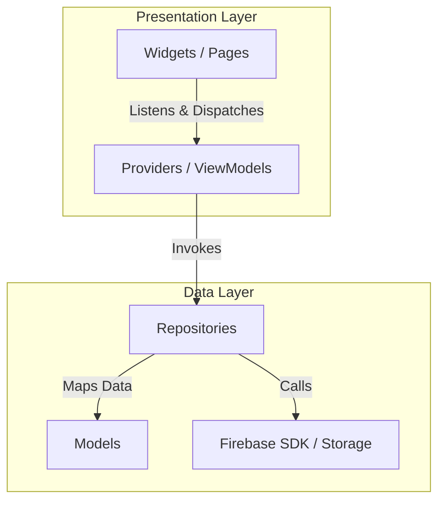
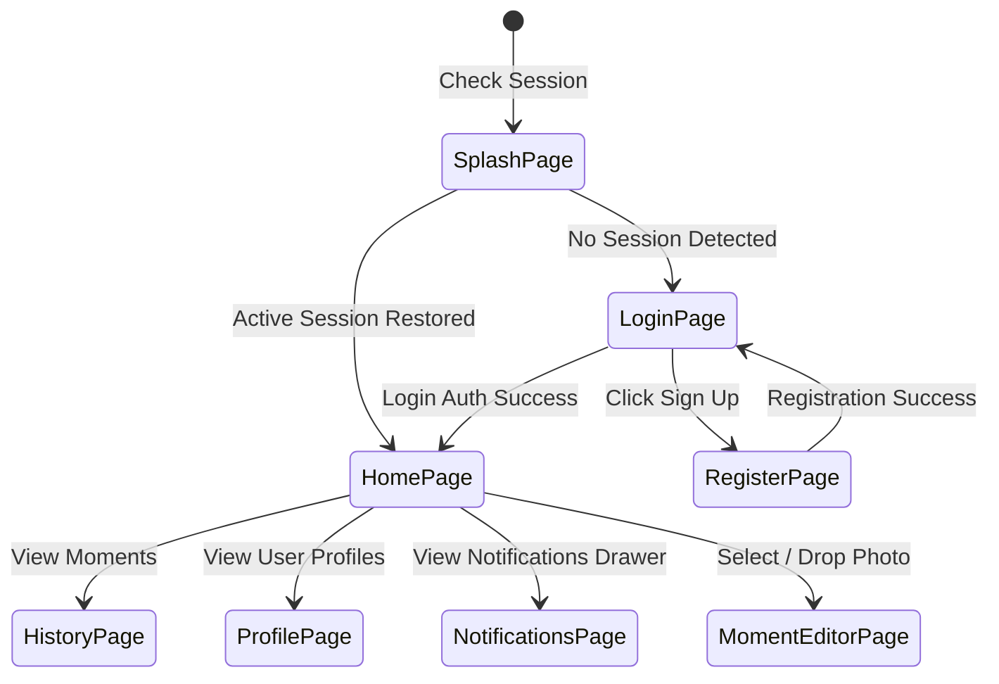

# 🏗 Flutter Clean Architecture Design

This document details the software design patterns, layer separations, and dependency rules adopted in the PingPic repository.

---

## 📂 Core Directory Structure

The project follows a modified **Clean Architecture & Feature-based** hierarchy:

```text
lib/
├── app.dart                        # Central MaterialApp setup and localization bindings
├── firebase_options.dart            # Auto-generated Firebase environment targets
├── main.dart                       # App entry point (initializes Firebase & runs ProviderScope)
├── core/                           # System core infrastructure
│   ├── constants/                  # Color configurations, labels, and local strings
│   ├── router/                     # GoRouter mappings, redirect logs, and transitions
│   ├── services/                   # Low-level system helper services (Presence, Notification, Image)
│   ├── theme/                      # Dynamic Material 3 typography and dark mode themes
│   └── utils/                      # Low-level error helpers and date formatters
├── data/                           # Data layer concrete classes
│   ├── datasources/                # Network APIs, offline storage connectors (empty, combined in repos)
│   ├── models/                     # Serializable JSON schemas mapped to Firestore structures
│   └── repositories/               # Repository implementations talking to Firebase Storage/Firestore
├── domain/                         # Domain layer enterprise patterns
│   └── entities/                   # (Clean architecture placeholders for pure data structures)
└── presentation/                   # UI presentation layer
    ├── pages/                      # Target routing view pages (Splash, Login, Home, Profile)
    ├── providers/                  # Provider State Managers coordinating view model logics
    └── widgets/                    # Modular reusable UI widgets (PhotoCard, DragDropZone, CameraPanel)
```

---

## 🔄 Architectural Layer Responsibilities

The layers follow strict dependency flow rules: **Presentation depends on Domain, and Data depends on Domain, with Domain containing pure logic independent of external libraries.**



### 1. The Core Infrastructure (`lib/core/`)
- Contains global configurations, helpers, themes, and utility services.
- **Service Separation**: Features separate stub, web, and mobile helpers to achieve complete platform independence without compile issues (e.g. conditional imports in `webcam_helper.dart` and `image_compressor.dart`).

### 2. The Data Layer (`lib/data/`)
- Implements repositories defined by logical data operations.
- Houses serializable data structures (Models) that inherit and map pure entity properties to network payload boundaries (e.g., parsing Firestore's dynamic JSON models via `CommentModel.fromFirestore`).

### 3. The Presentation Layer (`lib/presentation/`)
- Pure user interface rendering and dynamic state tracking.
- Providers act as the ViewModel binding user gesture dispatches to repository data streams, handling network errors internally and updating the responsive layouts reactively.

---

## 🧭 Routing Structure (`lib/core/router/app_router.dart`)

Navigation is driven by **GoRouter** to enable native-feeling deep-links and back-navigation within desktop browser contexts.


- **Splash Gate**: Automatically audits the user session on startup, checking SharedPreferences `remember_me` configurations and Firebase tokens before routing.
- **Dynamic Routing Parameters**: Mapped routes like `/profile/:userId` dynamically load separate target profiles from Firestore.
- **Web Address Sync**: Changing screens instantly updates the browser address bar, ensuring that sharing URLs leads directly to the specific pages.
