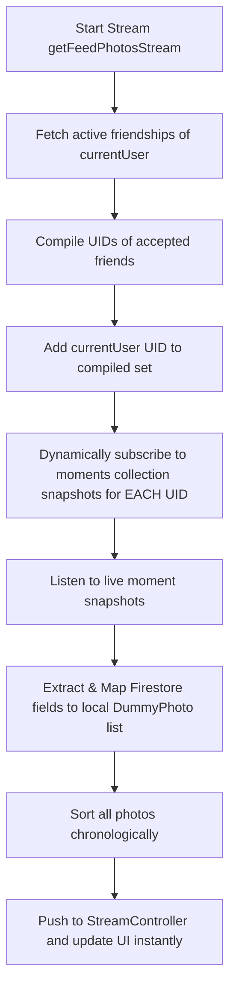

# 🔥 PingPic - Firebase Architecture

PingPic leverages the Firebase ecosystem as its real-time backend engine. This document outlines the schema design, real-time sync pipelines, and background processing models implemented in Firestore and Firebase Storage.

---

## 📊 Firestore Schema Design

Firestore is configured as a real-time NoSQL database. The collection schemas are structured to support low-latency feed updates, immediate presence indications, and private comments.

### 1. `users` Collection
Stores comprehensive user profile metadata.
```json
{
  "uid": "String (Document ID)",
  "email": "String",
  "fullName": "String",
  "avatarUrl": "String (URL to Firebase Storage)",
  "createdAt": "Timestamp",
  "isOnline": "Boolean",
  "lastSeen": "Timestamp"
}
```

### 2. `moments` Collection
Stores photo metadata and interaction counters.
```json
{
  "documentId": "String (Auto-generated ID)",
  "userId": "String (Reference to user's uid)",
  "imageUrl": "String (Reference to high-res JPG in Storage)",
  "caption": "String (Nullable)",
  "createdAt": "Timestamp / FieldValue.serverTimestamp()",
  "reactionCount": "Number",
  "likes": [
    "String (Array of user UIDs who double-tapped/liked)"
  ]
}
```

#### 📁 `comments` Sub-collection (Path: `/moments/{momentId}/comments/{commentId}`)
Ensures localized private commenting threads tied to specific moments, indexed for privacy.
```json
{
  "commentId": "String (Auto-generated ID)",
  "senderId": "String",
  "receiverId": "String",
  "participants": [
    "String (Array containing [senderId, receiverId])"
  ],
  "text": "String",
  "createdAt": "Timestamp",
  "senderName": "String",
  "senderAvatar": "String"
}
```

### 3. `friendships` Collection
Tracks connections between users using requester/receiver structures.
```json
{
  "documentId": "String (Auto-generated ID)",
  "requesterId": "String",
  "receiverId": "String",
  "status": "String (Enum: 'pending' | 'accepted')",
  "createdAt": "Timestamp"
}
```

### 4. `notifications` Collection
Feeds the live in-app notifications drawer.
```json
{
  "documentId": "String (Auto-generated ID)",
  "receiverId": "String",
  "senderId": "String",
  "senderName": "String",
  "senderAvatar": "String",
  "type": "String (Enum: 'moment_posted' | 'comment' | 'reply' | 'like')",
  "title": "String",
  "body": "String",
  "imageUrl": "String (Nullable)",
  "postId": "String (Nullable)",
  "postOwnerId": "String (Nullable)",
  "createdAt": "Timestamp",
  "isRead": "Boolean"
}
```

### 5. `notifications_queue` Collection
Triggers backend Cloud Functions to dispatch push notifications to offline users.
```json
{
  "documentId": "String (Auto-generated)",
  "senderId": "String",
  "senderName": "String",
  "imageUrl": "String",
  "caption": "String",
  "createdAt": "Timestamp",
  "status": "String (Enum: 'pending' | 'processed')"
}
```

---

## ⚡ Real-time Synchronization Architecture

The reactive feed is driven by a custom stream merging layer in `PhotoRepository` that avoids complex querying constraints:



### Advantages of the Pipeline:
1. **Dynamic Mapping**: By establishing separate queries per friend, the app sidesteps Firestore's limitation of 30 items in standard `whereIn` array queries.
2. **Local Caching**: Integrates a 5-minute memory cache mapping user UIDs to full names and avatars. This reduces Firestore document requests by over 80% on fast scroll feeds.
3. **Automatic Cleanup**: Canceling the feed stream subscription instantly tears down all child snapshot listeners, preventing memory leaks in browser sessions.

---

## 🗄 Storage Layout & Rules

Firebase Storage stores user-generated files in isolated directory structures:
- **Profiles**: `profiles/{userId}/avatar.jpg`
- **Moments**: `moments/{userId}/{timestamp}.jpg`

### Security Rules (Firestore & Storage):
- **User Isolation**: Users can only upload and write files inside their designated directories (`{userId}/`).
- **Privacy Bounds**: Reading comments requires the user's UID to match one of the entries in the comment's `participants` array.
- **Friendship Locks**: Post streams can only be accessed by authenticated users who share an `accepted` friendship state in the database.
