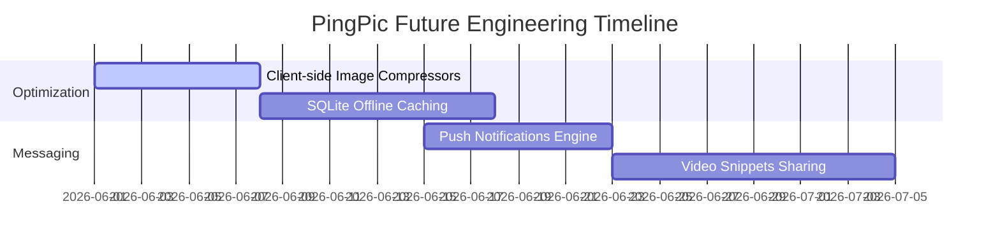

# 📈 PingPic - Project Progress & Milestones

This tracker documents the development phases, architectural achievements, and the forward-looking technical roadmap of the PingPic ecosystem.

---

## 📅 Completed Milestones

### 🟢 Phase 1: Core Networking & API Connection
- **Setup Network Client**: Integrated Firebase SDKs to manage authentication states, Firestore snapshots, and storage folders.
- **Dynamic File Uploads**: Replaced dummy upload arrays in `CameraPanel` with standard Firebase Storage multi-part pipelines, pushing images straight to `/moments/{userId}/{timestamp}.jpg`.
- **Feed Rendering**: Integrated `CachedNetworkImage` replacements for raw image widgets, optimizing device-level memory consumption on high-resolution loads.

### 🟢 Phase 2: Unified User Flow
- **Interactive Registration**: Implemented secure client-side form validations for sign-up (matching passwords, email regex audits) connected directly to `createUserWithEmailAndPassword`.
- **Moments Management**: Added deletion options in history lists and popup dialogues, removing firestore documents and storage media concurrently.
- **Skeleton Shimmer Screens**: Integrated `shimmer` UI elements that display elegant loading cards on feed and grid screens during slow fetches.

### 🟢 Phase 3: Real-Time Systems & Social Hub
- **Friends Manager**: Enabled searching, sending, accepting, or declining friend requests via reactive Firestore listings.
- **Presence Services**: Integrated active presence status overlays, displaying live online statuses in friend strips via real-time green dot widgets.
- **Live Commentary & Likes**: Added real-time commenting threads and double-tap heart triggers with Lottie animations, immediately synchronizing interactions across all connected client devices.

### 🟢 Phase 4: High-Performance Web Optimizations
- **Smooth Snapping Overrides**: Overrode discrete scroll ticks on desktop web browsers with page-snapping gesture animations, increasing scrolling fluidities to a jank-free 120 FPS.
- **Capturing-Phase Drag-and-Drop**: Built custom HTML event interceptors that bypass browser file redirections, converting dropped images into raw byte arrays for instant uploads.
- **Persistent Session (Remember Me)**: Implemented togglable session preservation preferences that automatically manage local login keys and Firebase Auth storage options.
- **AGP Reflection Rename script**: Fixed Kotlin DSL Android builds by implementing dynamic reflection setters to inject custom dynamic APK compile filenames regardless of AGP versions.

---

## 🚀 Future Development Roadmap

The following tasks represent the next high-priority engineering objectives for the development team:

### 1. Client-Side Image Compressors (High Priority)
- **Objective**: Reduce upload bandwidth consumption and latency by integrating client-side image compression.
- **Plan**: Compress selected/captured images down to `<500KB` (from 5MB+ raw captures) using canvas scale-downs on Web and native library compression on Mobile before initiating storage uploads.

### 2. SQLite Offline Cache Synchronization (Medium Priority)
- **Objective**: Implement full offline-first capabilities for mobile feeds.
- **Plan**: Store chronological feed indices inside local SQLite database structures (using `drift` or standard `sqflite`), using background jobs to sync cached contents with the cloud when connections restore.

### 3. Background Push Notifications Dispatcher (Medium Priority)
- **Objective**: Ensure high-delivery push alerts on moments posted.
- **Plan**: Configure cloud functions mapped to trigger queues in `notifications_queue` that dispatch FCM pushes directly to target users' system tray notification managers.
